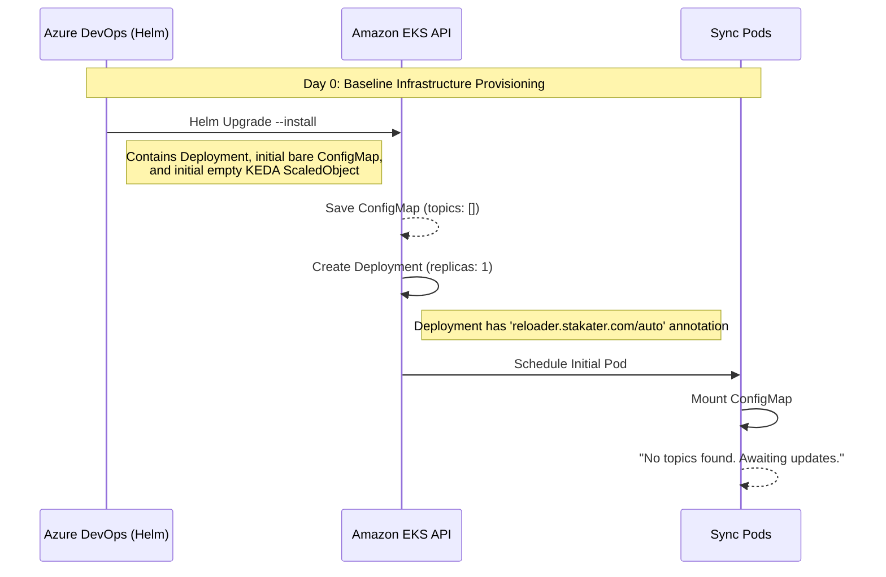
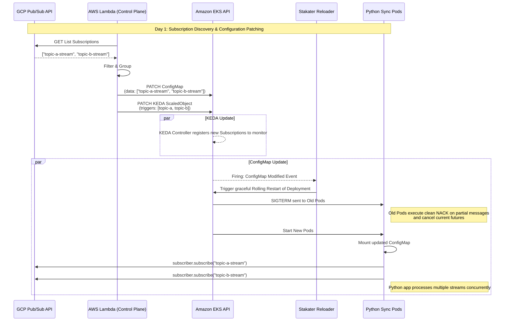
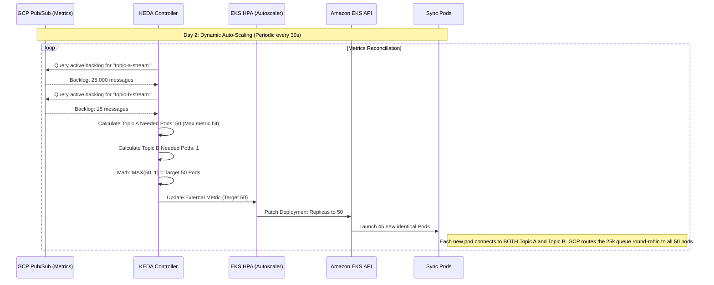

# Auto-Scaling GCP Pub/Sub to AWS SQS Sync Architecture

This document formally details the architecture, deployment lifecycle, and operational sequence for syncing data from Google Cloud Platform Pub/Sub to Amazon SQS using an Event-Driven, Auto-Scaling Kubernetes deployment on AWS EKS.

## System Components

1.  **GCP Pub/Sub**: The source of the streaming and batch event data.
2.  **AWS SQS**: The target destination for the flattened payloads.
3.  **Amazon EKS (Elastic Kubernetes Service)**: The runtime environment for the python synchronization pods.
4.  **KEDA (Kubernetes Event-driven Autoscaling)**: An operator that scales EKS Deployments based on external metrics (specifically, the backlog size of the GCP subscriptions).
5.  **Stakater Reloader**: A Kubernetes controller that watches for changes in ConfigMaps and triggers graceful rolling restarts of Deployments relative to those configs.
6.  **AWS Lambda (Configurator)**: A scheduled serverless function that acts as the "control plane." It periodically queries GCP for active subscriptions, groups them by business logic, and dynamically patches the EKS ConfigMaps and KEDA ScaledObjects.
7.  **Azure DevOps (ADO)**: The CI/CD pipeline responsible for the initial provisioning of the EKS resources via Helm.

---

## Operations Lifecycle

### Day 0: Initial Rollout (ADO Pipeline)

On Day 0, the infrastructure does not yet know which topics to consume. The focus is strictly on deploying the raw Kubernetes resources.

---

### Day 1: Dynamic Topic patching (Lambda discovering new workloads)

On Day 1 (and repeatedly every `X` hours), the active Lambda scheduler executes. It identifies any newly created GCP subscriptions or removed subscriptions that match the expected prefix rules. It then patches the configuration directly via the Kubernetes REST API. This triggers the rolling restart.

---

### Day 2: Auto-Scaling Under Lasting Load (KEDA Math)

On Day 2, the workloads are active and topics are being processed. Suddenly, a massive spike of traffic hits `topic-a-stream`. KEDA recognizes this load across the grouping and scales the pods out. Because GCP handles fair-share streaming pull mechanics, the new pods immediately offload `topic-a` traffic without impacting `topic-b`.

## Resilience, Limits, and Fault Isolation

As you consolidate workloads into shared deployment pods, protecting against "noisy neighbors" or poison-pill events becomes critical. Here is how this architecture handles constraints:

### 1. Fault Isolation (Segregation by Grouping)
- **Blast Radius Mitigation**: By segmenting topics into distinct groups (e.g., `streaming` vs `batch` vs `critical-tier-1`), you logically isolate failures. A malformed message (poison pill) crashing a pod in the `batch` deployment will completely disrupt all batch topics temporarily—but it will **zero impact** on the `critical-tier-1` deployment pods.
- **Poison Pill Handling**: The Python application must be wrapped in heavy `try/except` blocks (as seen in the `multi_topic_example.py`). If a specific message cannot be parsed, the Python app should `nack()` the message or forward it to a Dead Letter Queue (DLQ) without crashing the unified pod.

### 2. Resource Limits & Throttling
- **Memory (OOM) Management**: KEDA natively scales horizontally to prevent single-pod OOMs, but you must still define strictly bounded Kubernetes Resource Limits (e.g., `resources: limits: memory: 2Gi`) on the Deployment. The Python pub/sub client buffers messages locally; if it outpaces SQS, the pod could run out of memory. 
- **Backpressure via Flow Control**: The GCP Python SDK supports `flow_control`. You should implement limits (e.g., `max_messages=1000` or `max_bytes=50MB`) on the GCP subscriber client. The pod will automatically stop requesting messages from GCP if the local buffer hits this size, completely eliminating OOM risks regardless of how fast GCP can send data.

### 3. Scaling Constraints
- **Maximum API Quotas**: KEDA solves under-scaling, but runaway scaling can exhausted downstream APIs or VPC IP space. You control this heavily at the `ScaledObject` level using `maxReplicaCount`. For example, setting `maxReplicaCount: 50` guarantees the HPA will never expand the deployment beyond 50 pods, no matter how large the GCP backlog grows.
- **Fair-Share Hashing**: If Topic A has 10 Million messages and Topic B has 500, capping the max replicas ensures all pods stay active. GCP native load balancing uses fair-distribution; it will continue serving Topic B messages alongside Topic A's flood to all 50 active pods simultaneously.

---

## Summary of Responsibilities

- **DevOps/Helm**: Ensure the `reloader.stakater.com/auto` annotation is present on the unified Deployment template.
- **Python Engineer**: Ensure the python application catches `SIGTERM` and safely cancels or `nack()`s active processing messages so Reloader's rolling restart doesn't drop messages.
- **Platform Engineer (Lambda)**: Ensure the Lambda script creates a 1:1 parity between what it writes to the ConfigMap array and what `gcp-pubsub` Triggers it appends to the ScaledObject.
