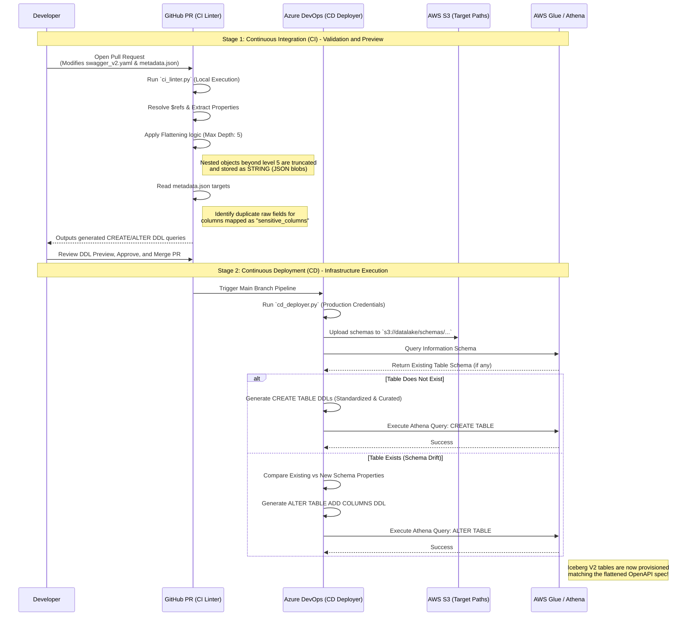

# Schema Management Lifecycle Diagrams

This document details the CI/CD sequence for how schemas are validated, flattened, and dynamically deployed into AWS Glue/Athena using the Schema Management frameworks.

## CI/CD Schema Evolution Flow

This sequence diagram illustrates the lifecycle of a schema change: from a developer proposing a change via a Pull Request, through local CI linting (validating constraints, checking for drift, and truncating fields at depth limit 5), down to CD deployment and the actual infrastructure updates executed by `cd_deployer.py`.

### Key Mechanisms Detailed
1. **Depth Limits**: Notice how `ci_linter.py` and `cd_deployer.py` both enforce the `max_depth: 5` flattening rule locally without needing to query AWS. This prevents runaway recursion before runtime.
2. **Sensitive Data Forking**: The linter identifies columns tagged as PII in the `metadata.json` and duplicates them under the hood during the DDL generation phase (masking the primary field with Iceberg comments, and appending an unmasked `_raw` column to the Standardized target only).
3. **Idempotency via Athena**: The deployer specifically queries the `Information Schema` of AWS Glue to determine if an `ALTER` or `CREATE` is required, ensuring that the CD pipeline can safely be run repeatedly without breaking existing tables.
