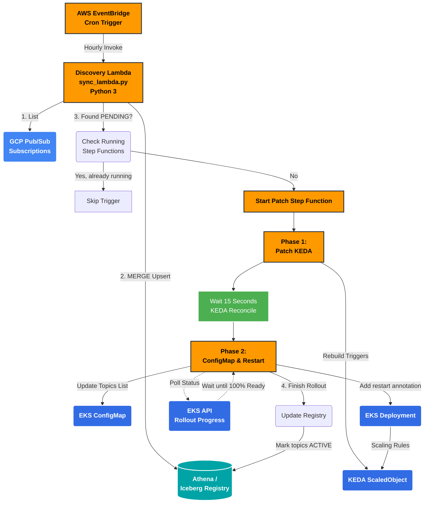

# GCP Sync (v3)

A serverless architecture designed to explicitly solve the problem of **dynamic scaling and configuration of Kubernetes consumer pods against GCP Pub/Sub topics**. It synchronizes an internal registry with active GCP topic metadata and dynamically patches Kubernetes to scale EKS consumer pod capacity up and down seamlessly without manual operator intervention.

## The Problem
Traditionally, bridging messages from Google Cloud Platform (GCP) Pub/Sub topics into an AWS-hosted Kubernetes (EKS) environment requires rigid, statically defined Deployments. When a new Pub/Sub topic is created in GCP, an operator typically has to:
1. Update a configuration file (like a ConfigMap) to tell the containers to pull from the new topic.
2. Update the KEDA (Kubernetes Event-driven Autoscaling) `ScaledObject` metrics so KEDA knows to monitor and scale replicas based on the new topic's queue length.
3. Restart the deployment manually to pick up the new configuration.

This manual process is error-prone, slow, and does not scale well when pipelines have dynamic incoming data schemas that provision new topics on the fly. 

## The Solution
`sync-v3` fully automates this bridging pipeline. The framework decouples *discovery* of Pub/Sub topics from the *deployment configuration* inside K8s.

1.  **EventBridge Triggers Sync Lambda:** An EventBridge CRON rule runs `sync_lambda.py` hourly.
2.  **Pull Active Metadata:** The Lambda uses the `pubsub_v1` SDK to pull a list of all active GCP Subscriptions in the project and compares it against AWS Iceberg Registry metadata via Athena.
3.  **Athena MERGE Upsert:** The registry is updated based on changes. Known subscriptions stay `ACTIVE`, new ones are appended as `PENDING`, and deleted/orphaned ones are flagged `REMOVED`. All interactions with Athena use strict parameterized queries (via `ExecutionParameters`) to prevent SQL injection and errors in string interpolation.
4.  **Concurrent Guard Check:** If multiple groups have `PENDING` items, it paginates through Step Functions APIs (`list_executions`) to verify if a patch sequence is already running for a group. This prevents race conditions and corrupted K8s patches.
5.  **Trigger Step Function:** If the group is unpatched, `sync_lambda` dynamically spins up an AWS Step Function containing the patch sequence logic.
6.  **KEDA Path Scaling (Stage 1):** The Step Function triggers `patcher_lambda` (Phase 1). The lambda authenticates to EKS using short-lived AWS STS identities, reads the `ACTIVE` & `PENDING` list of topics from Athena, and reconstructs the triggers array inside the target `ScaledObject`.
7.  **Patch ConfigMap (Stage 2):** It waits 15 seconds to let KEDA catch up, then patches the EKS `ConfigMap` and explicitly drops an annotation on the target K8s Deployment YAML (`restartedAt`). This annotation change natively forces a Kubernetes Rolling Restart without ever dropping the workload to zero.
8.  **Wait For Ready Condition:** `patcher_lambda` polls the EKS API continuously, executing lazy-refreshes of its STS token on every API call (protecting against 60-second AWS credential timeouts). It waits until `updatedReplicas` and `readyReplicas` exactly match the deployment specification without any `unavailableReplicas`.
9.  **Mark Topic Active:** Once rolling out has successfully completed and EKS reports a healthy ReplicaSet, the newly patched group in the Iceberg Registry flips from `PENDING` to `ACTIVE`.

## System Architecture Flowchart



## Environment Details
*   **Infrastructure Context:** Targeted for an AWS EKS Cluster running side-by-side with GCP Pub/Sub.
*   **Language:** Python 3 (Lambdas are standard Python deployment packages).
*   **Permissions:** Lambdas require restricted `states:ListExecutions`, EKS HTTP connection abilities, IAM STS generation capabilities, and basic Athena execution policies.
*   **Kubernetes API:** All modification calls to Kubernetes are done safely and RESTfully via Python `urllib` avoiding thick external dependencies like `kubectl` packages to keep Lambda cold-starts virtually instantaneous.


## Testing on an EKS Cluster

If you are bootstrapping this project onto a new EKS Cluster, you will need to establish the baseline Kubernetes resources first. `patcher_lambda.py` is capable of explicitly creating (`POST`) missing `ScaledObject` or `ConfigMap` resources, but the **target Deployment and Secrets must exist beforehand.** 

Use the old `integrated-scaling-poc` directory as a baseline to construct your Kubernetes infrastructure. 

### Step 1: Create the baseline namespace and deploy your GCP Auth Secret
Ensure the cluster has KEDA installed (you do not need Helm, you can install KEDA directly via `kubectl apply` using their official release manifests):
```bash
# Optionally install KEDA without Helm:
kubectl apply --server-side -f https://github.com/kedacore/keda/releases/download/v2.16.1/keda-2.16.1.yaml

# Create the GCP Secret
kubectl create secret generic gcp-keda-auth-secret \
  --from-file=GoogleApplicationCredentials=path/to/your/gcp-sa-key.json
```
Check KEDA documentation to apply `TriggerAuthentication` targeting this secret (`gcp-keda-trigger-auth`).

### Step 2: Establish the Deployment
The lambdas expect a base deployment matching the namespace naming convention `gcp-consumer-{group}`. Apply the baseline manifest:

```yaml
# example deployment.yaml
apiVersion: apps/v1
kind: Deployment
metadata:
  name: gcp-consumer-baseline
  namespace: default
spec:
  replicas: 0 # KEDA will assume scaling control
  selector:
    matchLabels:
      app: gcp-consumer-baseline
  template:
    metadata:
      labels:
        app: gcp-consumer-baseline
    spec:
      containers:
      - name: consumer
        image: 487500748616.dkr.ecr.us-east-1.amazonaws.com/keda-multi-topic-worker:latest
        imagePullPolicy: Always
        env:
          - name: GCP_PROJECT_ID
            value: "wired-sign-858"
          - name: CONFIG_PATH
            value: "/app/config/topics.json"
        volumeMounts:
        - name: gcp-key-volume
          mountPath: /var/secrets/google
          readOnly: true
        - name: config-volume
          mountPath: /app/config
          readOnly: true
      volumes:
      - name: gcp-key-volume
        secret:
          secretName: gcp-keda-auth-secret
      - name: config-volume
        configMap:
          name: gcp-configmap-baseline # Even if it doesn't exist yet, mount it
```

### Step 3: Trigger the Pipeline
1. Ensure the Iceberg registry table exists in Athena.
2. Publish a few topics to GCP Pub/Sub.
3. Manually invoke the `sync_lambda.py` via AWS Console or CLI.
4. Watch `sync_lambda` discover the topics, log them to Athena, and dynamically spin up the Step function. 
5. Run `kubectl get events -w` to watch `patcher_lambda` dynamically build the KEDA `ScaledObject` and EKS `ConfigMap` and trigger the deployment rollout!
