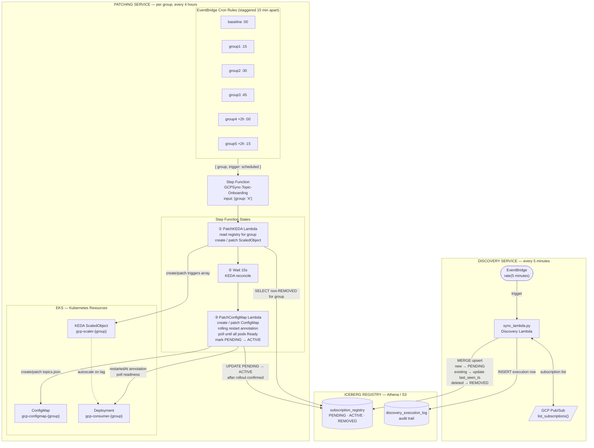

# GCP Sync v3 — Automated PubSub → EKS Consumer Management

A serverless architecture that continuously discovers GCP Pub/Sub subscriptions and
automatically reconciles the Kubernetes consumer infrastructure on EKS — KEDA ScaledObjects,
ConfigMaps, and rolling Deployment restarts — without any manual operator intervention.

---

## The Problem

Bridging GCP Pub/Sub topics into an AWS EKS environment traditionally requires static,
hand-maintained configuration. When a new Pub/Sub topic appears, an operator must:

1. Update the consumer **ConfigMap** so pods know which topics to read.
2. Update the **KEDA ScaledObject** so autoscaling monitors the new subscription's lag.
3. Manually **restart the Deployment** to pick up the updated configuration.

At 700–800 dynamically provisioned topics this process is untenable, and a naive
"restart everything at once" approach would cycle the entire EKS cluster simultaneously.

---

## The Solution

`sync-v3` separates the problem into two independent services with clearly different
cadences and responsibilities:

| Service | Runs | Responsibility |
|---|---|---|
| **Discovery Lambda** | Every 5 minutes | Sync GCP → Iceberg registry only. No K8s changes. |
| **Patching Step Function** | Every 4 hours per group, staggered | Reconcile KEDA + ConfigMap + rolling restart for one group at a time. |

Topics are bucketed into **groups** (e.g. `baseline`, `group1` … `group5`). Each group
has its own EventBridge cron rule, offset 15 minutes from the previous group, so
**at most one group is ever restarting simultaneously**. With ~100–150 topics per group
this bounds each rolling restart to a predictable, safe window.

---

## System Architecture



---

## Data Flow — Step by Step

### Discovery Service (every 5 minutes)

1. **EventBridge** triggers `sync_lambda.py` on a 5-minute rate.
2. Lambda calls the GCP Pub/Sub `list_subscriptions()` API to get the live topology.
3. **MERGE into Iceberg registry:**
   - New subscriptions → `INSERT` with `usage_group='baseline'`, `status='PENDING'`
   - Known subscriptions → `UPDATE last_seen_ts` only (`usage_group` is never overwritten — ops owns it)
   - Previously `REMOVED` subscriptions that reappear → reset to `PENDING`
4. **Mark removals:** subscriptions absent from GCP, or whose backing topic is
   `_deleted-topic_`, are set to `status='REMOVED'`.
5. **Audit log:** every run appends one row to `discovery_execution_log` recording
   `total_gcp_topics` and `removed_topics`.

No Kubernetes API calls happen here. No patching is triggered here.

### Ops: Assigning Topics to Groups

All newly discovered topics land in `baseline`. The support/ops team can reassign them
at any time with a plain Athena `UPDATE`:

```sql
UPDATE gcp_sync_db.subscription_registry
SET usage_group = 'group2'
WHERE subscription_name IN (
    'projects/wired-sign-858/subscriptions/payments-sub',
    'projects/wired-sign-858/subscriptions/orders-sub'
);
```

No code change or Lambda invocation is required. The next scheduled patch for `group2`
picks them up. The next scheduled patch for `baseline` removes them from its KEDA
triggers and ConfigMap.

### Patching Service (every 4 hours, per group, staggered)

Each group has a dedicated EventBridge cron rule offset 15 minutes from the previous
group. Only one group patches at a time.

| Group | Cron | Example fire times |
|---|---|---|
| `baseline` | `cron(0  0,4,8,12,16,20 * * ? *)` | 00:00, 04:00, 08:00 … |
| `group1`   | `cron(15 0,4,8,12,16,20 * * ? *)` | 00:15, 04:15, 08:15 … |
| `group2`   | `cron(30 0,4,8,12,16,20 * * ? *)` | 00:30, 04:30, 08:30 … |
| `group3`   | `cron(45 0,4,8,12,16,20 * * ? *)` | 00:45, 04:45, 08:45 … |
| `group4`   | `cron(0  2,6,10,14,18,22 * * ? *)` | 02:00, 06:00, 10:00 … |
| `group5`   | `cron(15 2,6,10,14,18,22 * * ? *)` | 02:15, 06:15, 10:15 … |

**Step Function states:**

**① PatchKEDA Lambda** (`keda_handler`)
- Authenticates to EKS via a pre-signed STS bearer token (refreshed on every API call
  to avoid the 60-second expiry during long operations).
- Reads all non-`REMOVED` subscriptions for the group from Athena.
- Issues a `PATCH` (merge-patch) on the KEDA `ScaledObject` to replace the entire
  triggers array atomically — removed subscriptions are cleaned up automatically.
- If the `ScaledObject` does not yet exist, issues a `POST` (create) instead.

**② Wait 15 seconds** — gives the KEDA operator time to reconcile the updated
`ScaledObject` before pods are cycled.

**③ PatchConfigMap Lambda** (`configmap_handler`)
- Creates or patches the `ConfigMap` (`topics.json`) with the current subscription list.
- Verifies the target `Deployment` exists before issuing any restart (raises a clear
  `RuntimeError` if missing rather than a silent 404 PATCH).
- Stamps `kubectl.kubernetes.io/restartedAt` on the pod template — identical to
  `kubectl rollout restart` — triggering a zero-downtime rolling update.
- **Rollout confirmation loop:** polls `updatedReplicas`, `readyReplicas`,
  `unavailableReplicas`, and the `Progressing` condition every 10 seconds until all
  pods are healthy, or raises `TimeoutError` after `ROLLOUT_TIMEOUT_SECONDS`.
- Only after rollout completes: flips `PENDING → ACTIVE` in the registry so the
  registry reflects what is actually running.

---

## Repository Layout

```
sync-v3/
├── lambda_sync/
│   ├── sync_lambda.py        # Discovery service — registry sync only
│   └── requirements.txt      # google-cloud-pubsub (bundled with zip)
│
├── lambda_patcher/
│   ├── patcher_lambda.py     # Patcher service — KEDA + ConfigMap + rollout
│   └── requirements.txt      # stdlib + boto3 only (no extra deps)
│
└── terraform/
    ├── main.tf               # All AWS infrastructure
    └── .terraform.lock.hcl   # Provider version pins
```

---

## Environment Variables

### Discovery Lambda

| Variable | Default | Description |
|---|---|---|
| `GCP_PROJECT_ID` | `wired-sign-858` | GCP project to list subscriptions from |
| `ATHENA_DATABASE` | `gcp_sync_db` | Glue/Athena database name |
| `ATHENA_TABLE` | `subscription_registry` | Iceberg registry table |
| `ATHENA_OUTPUT_LOC` | — | S3 URI for Athena query results |
| `ICEBERG_DATA_BUCKET` | — | S3 bucket for Iceberg data files |
| `ATHENA_POLL_TIMEOUT` | `120` | Max seconds to wait for any Athena query |
| `GOOGLE_APPLICATION_CREDENTIALS` | — | Path to GCP service-account JSON in Lambda package |

### Patcher Lambda (both handlers)

| Variable | Default | Description |
|---|---|---|
| `EKS_CLUSTER_NAME` | `gcp-sync-poc-test` | EKS cluster to patch |
| `EKS_REGION` | `us-east-1` | AWS region |
| `NAMESPACE` | `default` | Kubernetes namespace |
| `KEDA_SUBSCRIPTION_SIZE` | `5` | Message-lag threshold per KEDA trigger |
| `KEDA_MIN_REPLICAS` | `0` | Scale-to-zero when idle |
| `KEDA_MAX_REPLICAS` | `10` | Upper replica bound |
| `KEDA_POLLING_INTERVAL` | `30` | Seconds between KEDA lag checks |
| `ROLLOUT_TIMEOUT_SECONDS` | `240` | Max seconds to wait for rolling restart |
| `ATHENA_POLL_TIMEOUT` | `120` | Max seconds to wait for any Athena query |

---

## Kubernetes Resource Naming Convention

All resource names are derived from the group name at runtime:

| Resource | Name pattern | Example |
|---|---|---|
| KEDA ScaledObject | `gcp-scaler-{group}` | `gcp-scaler-baseline` |
| ConfigMap | `gcp-configmap-{group}` | `gcp-configmap-group1` |
| Deployment | `gcp-consumer-{group}` | `gcp-consumer-baseline` |

The Patcher will `POST` (create) a missing `ScaledObject` or `ConfigMap` on first
bootstrap. **The Deployment must exist before the patcher runs** — the Lambda raises
a descriptive error if absent rather than failing silently.

---

## Deploying to a New Cluster

### Prerequisites

```bash
# Install KEDA on the cluster
kubectl apply --server-side \
  -f https://github.com/kedacore/keda/releases/download/v2.16.1/keda-2.16.1.yaml

# Create the GCP credential secret
kubectl create secret generic gcp-keda-auth-secret \
  --from-file=GoogleApplicationCredentials=/path/to/gcp-sa-key.json

# Apply a TriggerAuthentication pointing at that secret (see KEDA gcp-pubsub docs)
```

### Baseline Deployment manifest

Create one Deployment per group before the first patch run:

```yaml
apiVersion: apps/v1
kind: Deployment
metadata:
  name: gcp-consumer-baseline
  namespace: default
spec:
  replicas: 0           # KEDA owns scaling
  selector:
    matchLabels:
      app: gcp-consumer-baseline
  template:
    metadata:
      labels:
        app: gcp-consumer-baseline
    spec:
      containers:
      - name: consumer
        image: <ecr-account>.dkr.ecr.us-east-1.amazonaws.com/gcp-consumer:latest
        env:
          - name: GCP_PROJECT_ID
            value: "wired-sign-858"
          - name: CONFIG_PATH
            value: "/app/config/topics.json"
        volumeMounts:
        - name: gcp-key-volume
          mountPath: /var/secrets/google
          readOnly: true
        - name: config-volume
          mountPath: /app/config
          readOnly: true
      volumes:
      - name: gcp-key-volume
        secret:
          secretName: gcp-keda-auth-secret
      - name: config-volume
        configMap:
          name: gcp-configmap-baseline   # created by patcher on first run
```

### Terraform deploy

```bash
# Vendor GCP SDK into the Discovery Lambda zip
cd sync-v3/lambda_sync
pip install -r requirements.txt -t .

cd ../terraform
terraform init
terraform apply
```

### Verify

```sql
-- Check registry state
SELECT usage_group, status, COUNT(*) as n
FROM gcp_sync_db.subscription_registry
GROUP BY usage_group, status
ORDER BY usage_group, status;

-- Check recent discovery runs
SELECT * FROM gcp_sync_db.discovery_execution_log
ORDER BY execution_ts DESC
LIMIT 20;
```

Watch a live patch on the cluster:
```bash
kubectl get events -w -n default
kubectl rollout status deployment/gcp-consumer-baseline -n default
```

---

## Design Decisions & Trade-offs

| Decision | Rationale |
|---|---|
| Discovery never triggers patching | Prevents uncontrolled restarts at scale. An on-demand trigger fired every 5 minutes would continuously cycle pods whenever any topic was PENDING. |
| Patching driven solely by EventBridge cron | Predictable, auditable, and independent of registry state. Each group's window is bounded and non-overlapping by construction. |
| 15-minute stagger between groups | Worst-case rollout (~4 min) completes well before the next group starts. |
| `usage_group` never overwritten by Discovery | Ops owns group assignment. Discovery only INSERTs new rows as `baseline`; it never changes existing assignments. |
| `PENDING → ACTIVE` only after rollout confirms | Registry truthfulness — a topic is only `ACTIVE` when the pods serving it are actually healthy. |
| `merge-patch+json` for KEDA ScaledObject | Replaces the entire triggers array atomically. Deleted subscriptions are cleaned up with no extra bookkeeping. |
| `restartedAt` annotation for rolling restart | Identical to `kubectl rollout restart`. Uses the Deployment's `RollingUpdate` strategy — zero downtime, no replica gap. |
| Fresh STS token per EKS API call | The 60-second STS token expiry would cause 401s during the rollout polling loop (up to 240s). The `token_func` lambda regenerates a signed URL on every call at negligible cost. |
| Parameterized Athena queries (`ExecutionParameters`) | All dynamic values (subscription names, group names) are passed as `?` parameters to prevent malformed queries from GCP names containing special characters. |
